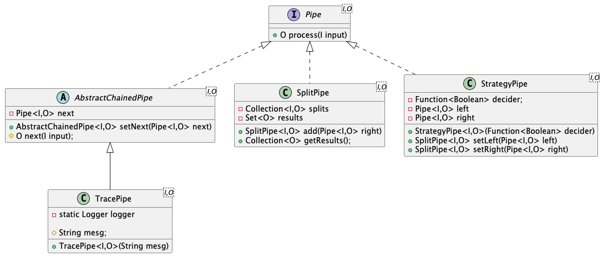

# Pipes

These classes implement a structure which can be used to "chain" together blocks of code via a mechanism 
of having widget "a" calling "b" as a sort of piped interface (of sorts).  Ideally the input to a widget
is transformed into an output which is then passed as an input to the next wigdet but in practice its 
generally easier to pass in a contaxt object as an overall input and then to pass that around through the
pipe implementations with returning the output from the final step in the pipeline.

Class Diagram

